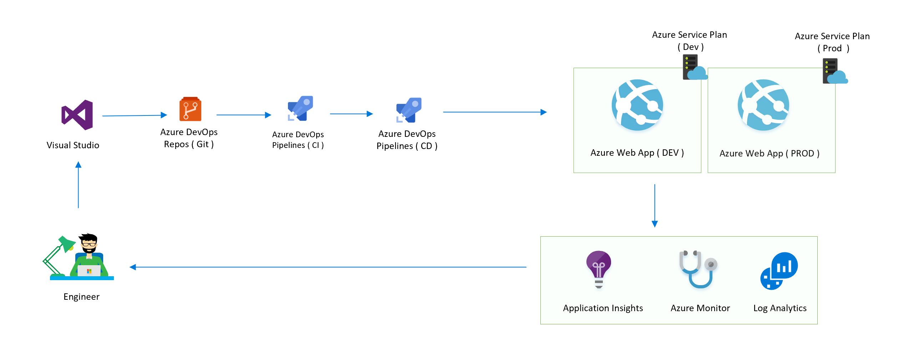
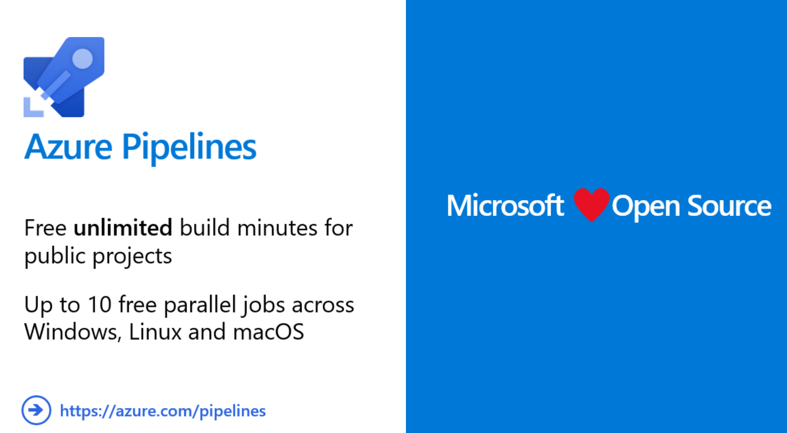

# Using Unified Yaml-defined multi-stage CI/CD Pipelines of Azure DevOps ( Build, Dev and Prod )
Sample code to deploy node.js application using unified Yaml-defined CI/CD Pipelines of Azure DevOps

Solution Diagram : 



Using unified CI/CD yaml definition pipeline:


## What is Azure DevOps ? 
Azure DevOps (previously Visual Studio Team Services / VSTS) is Microsoft's answer to DevOps, and is essentially a cloud service for collaborating on code development, from writing the first lines of code through to building it, testing it and deploying it to production.

Azure DevOps

This consists of the following components:


Git repositories for source control of your code
Build and release management to support continuous integration and delivery of your apps
Agile tools to support planning and tracking your work, code defects, and issues using Kanban and Scrum methods
A variety of tools to test your apps, including manual/exploratory testing, load testing, and continuous testing
Highly customisable dashboards for sharing progress and trends
Built-in wiki for sharing information with your team
In addition, the Azure DevOps ecosystem provides support for adding extensions, integrating with other popular services, such as: Campfire, Slack, Trello, UserVoice, and more, and developing your own custom extensions

Azure pipeline as a core part of Azure DevOps, it allows for the creation of CI ( Continuous Integration) pipeline in a declarative way using YAML documents, it is also called build pipelines. Since last Build 2019, this capability is also extending to CD ( Continuous Delivery ) Pipelines which is also known as Release Pipelines.  More than expected is now it is possible to  define multi-stage pipelines-as-code for both Continuous Integration and Continuous Delivery with the same YAML definition file. 




## Getting started

Create an Azure account by browsing to https://azure.microsoft.com/en-us/free/ or claim your MSDN benefits to get a visual studio subscription.  Go to portal.azure.com and then Click on Cost Management and Billing on the left-hand panel. You should see your subscription name in the middle panel – it will be a long string of letters and numbers with hyphens between. Note this name somewhere. 

## Trigger and variable definition

```
# Node.js Express Web App to Linux on Azure
# Build a Node.js Express app and deploy it to Azure as a Linux web app.
# Add steps that analyze code, save build artifacts, deploy, and more:
# https://docs.microsoft.com/azure/devops/pipelines/languages/javascript


trigger:

- master

variables:

  # Agent VM image name
  vmImageName: 'ubuntu-latest'
  demorg: 'melon-cicd-rg'
  subscription : 'serviceconnectionname'
  webappname : 'melonsamplewebapp'


```


## Define your CI pipeline

In your CI pipeline, you need to define as the following, if you're going to automate your test, you'll need to define the test in prior : 

```
- stage: Build
  displayName: Build stage
  jobs:  
  - job: Build
    displayName: Build
    pool:
      vmImage: $(vmImageName)
    steps:
    - task: AzureCLI@1
      displayName: 'Azure CLI '
      inputs:
        azureSubscription: $(subscription)
        scriptLocation: inlineScript
        inlineScript: 'az group create --location northeurope --name $(demorg)'
    - task: AzureResourceGroupDeployment@2
      displayName: 'Azure Deployment:Create Or Update Resource Group action on $(demorg)'
      inputs:
        azureSubscription: $(subscription)
        resourceGroupName: '$(demorg)'
        location: 'North Europe'
        templateLocation: 'Linked artifact'
        csmFile: 'iac/webapp.json'
        csmParametersFile: 'iac/webapp.parameters.json'
        deploymentMode: 'Incremental'


    - task: NodeTool@0
      inputs:
        versionSpec: '10.x'
      displayName: 'Install Node.js'

    - script: |
        npm install
        npm run build --if-present
        # npm run test --if-present
      displayName: 'npm install, build and test'

    - task: CopyFiles@2
      displayName: 'Copy Files to: $(Build.ArtifactStagingDirectory)/$(webappname)'
      inputs:
        SourceFolder: '$(system.defaultworkingdirectory)'
        TargetFolder: '$(Build.ArtifactStagingDirectory)/$(webappname)'


    - task: ArchiveFiles@2
      displayName: '$(webappname) Archive'
      inputs:
        rootFolderOrFile: '$(Build.ArtifactStagingDirectory)/$(webappname)'
        includeRootFolder: false
        archiveType: zip
        replaceExistingArchive: true
        archiveFile: '$(Build.ArtifactStagingDirectory)/$(webappname).zip'


    - task: PublishPipelineArtifact@0
      displayName: 'PublishPipelineArtifact: drop'
      inputs:
        targetPath: '$(Build.ArtifactStagingDirectory)/$(webappname).zip'


```


## Define your CD pipeline

Please make sure you define different stages, dependencies and deployment condition :

Dev stage : 

```
- stage: Dev
  displayName: Dev stage
  dependsOn: Build
  condition: succeeded('Build')
  jobs:
  - deployment: Dev
    displayName: Dev
    environment: 'development'
    pool: 
      vmImage: $(vmImageName)
    strategy:
      runOnce:
        deploy:
          steps:
          - task: DownloadPipelineArtifact@1
            displayName: 'Download Pipeline Artifact'
            inputs:
              buildType: 'current'

          - task: AzureWebApp@1
            inputs:
              azureSubscription: '$(subscription)'
              appType: 'webApp'
              appName: '$(webappname)'
              package: '$(System.ArtifactsDirectory)/drop/$(webappname).zip'
              customWebConfig: '-Handler iisnode -NodeStartFile index.js -appType node'
              deploymentMethod: 'zipDeploy'
```

Prod stage : 

```
- stage: Prod
  displayName: Prod stage
  dependsOn: Dev
  condition: succeeded('Dev')
  jobs:
  - deployment: Prod
    displayName: Prod
    environment: 'production'
    pool: 
      vmImage: $(vmImageName)
    strategy:
      runOnce:
        deploy:
          steps:
          - task: DownloadPipelineArtifact@1
            displayName: 'Download Pipeline Artifact'
            inputs:
              buildType: 'current'

          - task: AzureWebApp@1
            inputs:
              azureSubscription: '$(subscription)'
              appType: 'webApp'
              appName: '$(prodwebappname)'
              package: '$(System.ArtifactsDirectory)/drop/$(webappname).zip'
              customWebConfig: '-Handler iisnode -NodeStartFile index.js -appType node'
              deploymentMethod: 'zipDeploy'

```

## Up & Running

The Dev environment application show as the following : 


